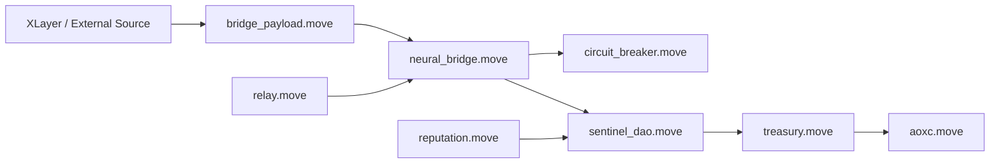

# AOXC Sui Protocol Whitepaper

## Executive Summary
AOXC Sui Protocol is a modular Move-based infrastructure for secure asset operations, governance-controlled safety, and typed cross-chain command handling.

The design goal is not maximal complexity, but **predictable safety**:
- strict type safety on Sui objects,
- constrained governance actions,
- replay-aware bridge command processing,
- clear operational checkpoints for audit and incident response.

---

## Vision and Principles

### Vision
Build a resilient protocol layer for Sui-native assets and controlled cross-layer coordination that can be audited, operated, and upgraded with institutional discipline.

### Engineering Principles
1. **Deterministic behavior over implicit behavior**.
2. **Typed payloads over raw bytes** wherever possible.
3. **Fail closed** (reject invalid states early).
4. **Operational clarity** through explicit events and checklists.
5. **Progressive hardening** with tests + threat modeling + formal verification.

---

## Problem Statement
Cross-chain and governance-enabled systems fail most often due to:
- ambiguous payload parsing,
- weak signer/quorum assumptions,
- replay and lifecycle edge cases,
- under-specified operational controls.

AOXC addresses this by separating concerns into small, auditable Move modules and enforcing explicit validations at module boundaries.

---

## Protocol Architecture



### Core Modules and Responsibilities
- `aoxc.move`: core asset object model, supply controls, metadata and checkpointing.
- `bridge_payload.move`: typed schema/version/target/chain validation for bridge commands.
- `neural_bridge.move`: command digesting, signature quorum checks, replay protection, execution gating.
- `relay.move`: attestor quorum lifecycle and report anchoring.
- `sentinel_dao.move`: governance action constraints and veto/timelock safety patterns.
- `treasury.move`: distribution and policy-guarded fund logic.
- `circuit_breaker.move`: emergency pause/resume safety switch.

---

## What the Current Codebase Does (High-Level)

### 1) Typed Bridge Validation
Bridge commands are parsed as typed payloads with checks for:
- schema version,
- chain id,
- allowed target module,
- sender format,
- proof root presence.

This reduces parser ambiguity and blocks malformed cross-layer messages before state transitions.

### 2) Quorum-Aware Command Execution
The neural bridge verifies command digest signatures and quorum constraints, then applies only valid pause/resume actions through circuit breaker controls.

### 3) Replay and Lifecycle Controls
Used digests are tracked to prevent command replay, and command metadata (e.g., epoch/deadline/confirmations) is validated before execution.

### 4) Governance + Treasury Safety Surface
DAO and treasury flows are structured around explicit guard functions and abort codes to keep failures deterministic and machine-checkable.

---

## Security and Audit Posture

### Strengths
- Clear modular boundaries.
- Strong use of explicit abort codes.
- Typed payload design reduces many classic bridge bugs.
- Negative tests exist for invalid states.
- Threat model/checklist/runbook docs already present.

### Still Not “Final-Full” Yet
The system is strong but still evolving. To reach conservative blue-chip readiness:
1. mandatory CI gates for build/test/prover,
2. deeper scenario coverage for multi-actor and recovery paths,
3. stronger formal property closure reports,
4. richer economic adapter implementations,
5. signed operational evidence bundles per release.

---

## Road to “Full” (Practical Plan)

### Phase A — Verification Closure
- Expand invariant specs for replay safety, signer thresholds, supply conservation.
- Add property-by-property prove evidence attached to release artifacts.

### Phase B — Operational Hardening
- Enforce branch protection + required checks.
- Standardize release dossier (hashes, signer logs, drill reports, compatibility report).

### Phase C — Economic Production Layer
- Complete adapter settlement/accounting pathways.
- Add adversarial tests around liquidity/market flows.

---

## Governance and Upgrade Philosophy
AOXC should evolve with **measured upgrades**:
- preserve backwards-safe schemas where possible,
- version payload formats explicitly,
- stage risky features behind guarded execution paths,
- publish compatibility notes with every protocol release.

---

## Visual Safety Layers

```text
[Input Payload]
     |
     v
[Schema/Chain/Target Validation] ----X----> Reject invalid
     |
     v
[Digest + Signature + Quorum Checks] -X----> Reject invalid
     |
     v
[Replay Check] ----------------------X----> Reject duplicate
     |
     v
[Execution Guard (Breaker/DAO)] -----X----> Block unsafe action
     |
     v
[State Transition + Event Emission]
```

---

## Limitations and Humble Positioning
This protocol is designed for high assurance, but no non-trivial protocol is permanently “error-free.”

The right claim is:
- **audit-ready direction with strong controls**,
- **continuous hardening still required**.

That is a healthier and more credible posture than over-claiming perfection.

---

## If We Wanted It “More Full”, What Would Be Added Next?
1. Signature domain/version rotation policy with explicit deprecation windows.
2. Independent parser differential tests (cross-language fixture conformance).
3. Chaos-style incident drills with measurable RTO/RPO targets.
4. Automated state snapshot reconciliation checks.
5. Public security dashboard (coverage, invariants, release evidence index).

---


## Quantum and Cryptographic Agility
AOXC should treat post-quantum readiness as a staged migration problem, not a marketing claim.

Recommended approach:
- maintain strict domain-separated digesting,
- add verifier abstraction points,
- adopt hybrid signature windows before any PQC-primary switch,
- publish migration evidence and compatibility boundaries.

See `docs/FUTURE_READINESS.md` for the execution roadmap.

## Conclusion
AOXC Sui Protocol already provides a meaningful security-first architecture with good modularity and typed validation.

With disciplined CI enforcement, deeper formal verification, and richer operational evidence, it can mature from “strong foundation” to “institutional production confidence.”
